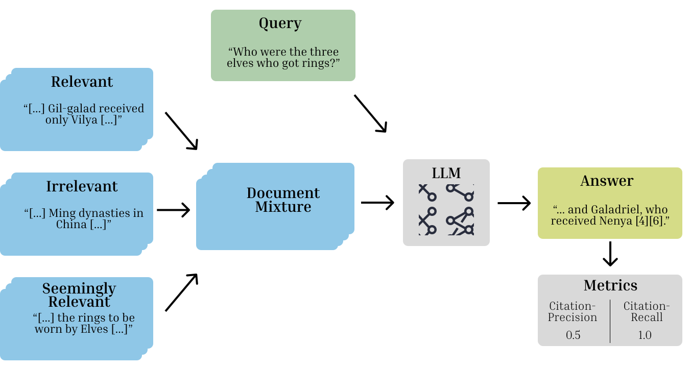

# RAGE - Retrieval Augmented Generation Evaluation

## TL;DR
RAGE is a tool for evaluating how well Large Language Models (LLMs) cite relevant sources in Retrieval Augmented Generation (RAG) tasks.

## What am I looking at?

RAGE is a framework designed to evaluate Large Language Models (LLMs) regarding their suitability for Retrieval Augmented Generation (RAG) applications.
In RAG settings, LLMs are augmented with documents that are relevant to a given search query.
The key element evaluated is the ability of an LLM to cite the sources it used for answer generation.

The main idea is to present the LLM with a query and with relevant, irrelevant, and seemingly relevant documents. 
Seemingly relevant documents are from the same area as the relevant documents but don't contain the actual answer.
RAGE then measures how well the LLM recognized the relevant documents.


*Figure 1: RAGE Evaluation Process. Examples are extracted from the [Natural Questions](https://ai.google.com/research/NaturalQuestions) Dataset.*

For a more detailed description of the inner workings, dataset creation and metrics, we refer to our paper:<br>
→ [Evaluating and Fine-Tuning Retrieval-Augmented Language Models to Generate Text With Accurate Citations](URL)

## Installation

Pip:
```python
pip install rage-toolkit
```

Build from source:

```bash
$ git clone https://github.com/othr-nlp/rage_toolkit.git
$ cd rage_toolkit
$ pip install -e .
```

## Get Started

We recommend starting at the [`rage_getting_started.ipynb`](rage_getting_started.ipynb) Jupyter Notebook. 
It gives you a quick introduction into how to set up and run an evaluation with a custom LLM.

## Datasets

Note that RAGE works with any datasets that comply with our format. Feel free to create your own datasets that suit your needs.

For guidance on creating one, take a look at our preprocessed examples or refer to our [paper](URL).

Our datasets are built on top of those from the BEIR Benchmark ([BEIR Benchmark](https://doi.org/10.48550/arXiv.2104.08663)).

Our preprocessed datasets can be found here:

| Original Dataset       | Website     | RAGE version on Huggingface                                               |
|------------------------|-------------|---------------------------------------------------------------------------|
| Natural Questions (NQ) | https://ai.google.com/research/NaturalQuestions | [RAGE - NQ](https://huggingface.co/datasets/othr-nlp/rage_nq)             |
| HotpotQA               | https://hotpotqa.github.io/ | [RAGE - HotpotQA](https://huggingface.co/datasets/othr-nlp/rage_hotpotqa) |
## License

This project is licensed under the MIT License - see the [LICENSE](./LICENSE) file for details.

## Contributing

Contributions are welcome! Feel free to open issues or submit pull requests for improvements.